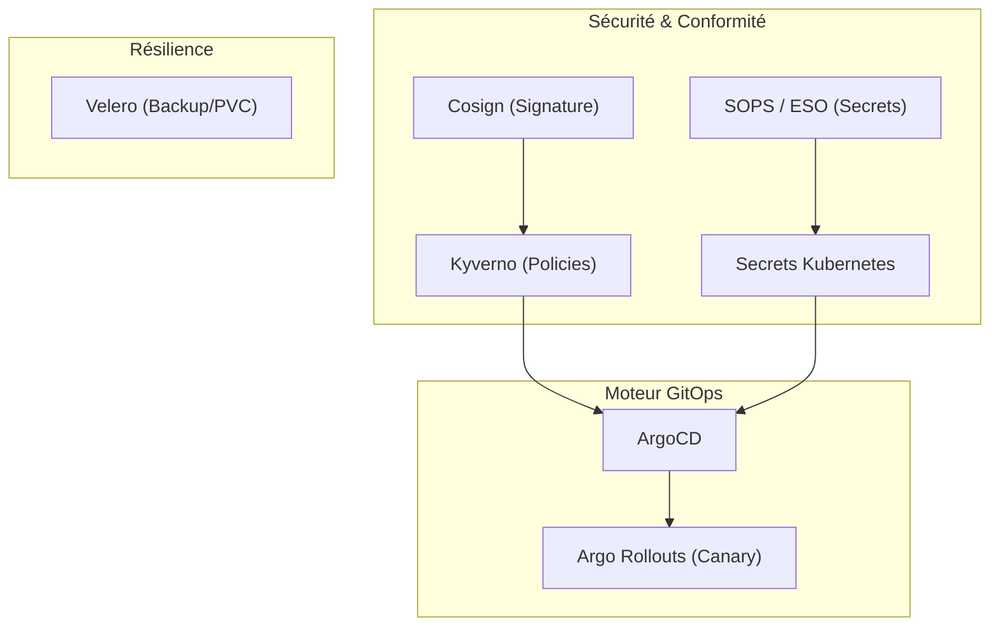

# Rapport de TP : GitOps avec ArgoCD — `DevHub Campus`

Ce rapport présente l'ensemble des réalisations, diagnostics et justifications techniques apportées lors de la conception, de la containerisation et du déploiement GitOps de la plateforme **DevHub Campus** avec **ArgoCD** sur un cluster **Kind**.

---

## Étape 0 — Outillage de la Plateforme

Pour ce TP, nous avons configuré et validé un environnement d'exécution local et portable sous Windows/WSL2. Les versions exactes des outils utilisés et documentées pour notre direction technique sont les suivantes :

* **`kubectl`** : `v1.34.1` (Kustomize `v5.7.1`)
* **`helm`** : `v3.15.2`
* **`kind`** : `v0.22.0`
* **`argocd` CLI** : `v2.11.2` (avec commit `25f7504ecc198e7d7fdc055fdb83ae50eee5edd0`)
* **`git`** : `v2.54.0`
* **`yq`** : `v4.44.1`

---

## Étape 1 — Comprendre GitOps en 1 Page

Le mouvement GitOps formalise la convergence continue entre un état souhaité déclaré dans Git et l'état réel du cluster Kubernetes.

### Comparatif Théorique : Modèle Push vs. Modèle Pull

| Critère / Question | *Push* (`kubectl apply` en CI) | *Pull* (ArgoCD) |
|---|---|---|
| **Qui a les droits sur le cluster ?** | La pipeline de CI (via un jeton Kubeconfig exposé, ce qui présente un risque de sécurité majeur). | L'agent de réconciliation local interne au cluster (ArgoCD). Aucune clé d'accès externe n'est exposée. |
| **Où est l'historique des changements ?** | Éparpillé entre les logs d'exécution de la CI et les commits de code applicatif. | Centralisé dans les dépôts de configuration Git de manière immutable et traçable. |
| **Que se passe-t-il si un dev modifie à la main ?** | Le changement survit silencieusement (*drift*) jusqu'au prochain déploiement qui l'écrase sans avertissement. | ArgoCD détecte l'écart instantanément, passe l'app en `OutOfSync` et la répare automatiquement si `selfHeal` est actif. |
| **Comment ajouter un environnement ?** | Copier les configurations dans la CI, modifier les scripts de déploiement et dupliquer les variables de secrets. | Déclarer un nouveau fichier manifest `Application` pointant vers le même dépôt mais un fichier de values distinct. |
| **Comment faire un rollback ?** | Rejouer manuellement une ancienne pipeline de CI ou exécuter un `kubectl rollout undo` non tracé. | Effectuer un `git revert` sur la branche principale ; ArgoCD applique automatiquement l'ancien état sain. |
| **Combien de pipelines pour 30 services ?** | 30 pipelines CI/CD complexes qui doivent chacune gérer l'authentification et l'application K8s. | 1 pipeline par service pour builder/pousser l'image, et ArgoCD gère l'application de façon unifiée. |
| **Qui voit *en direct* ce qui tourne ?** | Seuls les administrateurs avec accès direct au cluster via CLI ou via des outils comme Freelens. | Tous les développeurs de l'équipe via l'interface web unifiée et interactive d'ArgoCD. |

### Positionnement Professionnel
> *"Pour mes futurs projets professionnels et personnels, je privilégierai systématiquement l'approche **Pull (GitOps)**. Non seulement elle sécurise le cluster en éliminant le besoin de partager des identifiants avec des outils de CI externes, mais elle garantit aussi qu'aucun changement n'a lieu sur le cluster sans avoir été validé par un processus de revue de code (Pull Request) dans Git."*

---

## Étape 2 — Vocabulaire et Glossaire ArgoCD

Afin de structurer notre communication technique, voici les définitions clés illustrées par des exemples de notre projet :

1. **`Application`** : Ressource personnalisée (CRD) d'ArgoCD décrivant la liaison entre une source (Git) et une destination (Kubernetes).
   * *Exemple dans notre projet* : `annuaire-dev` qui pointe vers `services/annuaire/chart` et le namespace `devhub-dev`.
2. **`AppProject`** : Groupement logique d'applications définissant des barrières de sécurité (dépôts autorisés, namespaces cibles, types de ressources autorisées).
   * *Exemple dans notre projet* : Le projet `devhub` restreignant le déploiement aux seuls dépôts internes et namespaces applicatifs du projet.
3. **`Source`** : Dépôt Git ou Helm d'origine contenant l'état désiré.
   * *Exemple dans notre projet* : Le dépôt interne `http://local-git-server.argocd.svc/git/devhub-campus.git`.
4. **`Destination`** : Cluster Kubernetes et namespace dans lequel les ressources doivent être créées.
   * *Exemple dans notre projet* : Cluster interne `https://kubernetes.default.svc` et namespace `devhub-dev`.
5. **`Sync`** : Action de synchroniser le cluster avec l'état Git. Elle peut être manuelle ou automatisée avec options de réparation.
6. **`Prune`** : Option de synchronisation supprimant les ressources du cluster qui ne sont plus décrites dans le dépôt Git.
7. **`App of Apps`** : Pattern d'architecture où une application racine ArgoCD unique déploie et orchestre d'autres applications ArgoCD enfants.
   * *Exemple dans notre projet* : L'application `root` dans `platform/bootstrap/root-app.yaml`.
8. **`ApplicationSet`** : Générateur d'applications dynamique permettant de boucler sur des paramètres (branches Git, PRs, fichiers) pour instancier des applications ArgoCD.
9. **`Sync wave`** : Mécanisme ordonnant le déploiement des ressources d'une même application à l'aide d'annotations numériques (ex. déployer la DB avant l'application).
10. **`Hook`** : Scripts ou Jobs Kubernetes déclenchés à des phases précises de la synchronisation (ex. migrations de base de données en `PreSync`).

---

## Étape 3 — Containerisation des Microservices

Pour répondre aux exigences de sécurité, de performance et d'empreinte minimale, chaque microservice dispose d'un `Dockerfile` multi-stage hautement optimisé :

### A. `annuaire-service` (Node.js)
* **Approche Multi-stage** : Une étape de construction (`build`) prépare les dépendances de production (`npm install --omit=dev`), puis l'image d'exécution (`runtime`) ne conserve que le code source utile et les dépendances nécessaires.
* **Sécurité** :
  * Image de base alpine légère (`node:20-alpine`).
  * Création d'un groupe et d'un utilisateur non-root dédié (`appuser` avec l'UID `1001`) pour éviter toute exécution avec les privilèges root.

### B. `planning-service` (Python FastAPI)
* **Approche Multi-stage** : L'étape de `build` installe les dépendances dans un environnement virtuel (`venv`) à l'aide de `requirements.txt`. L'étape de `runtime` copie cet environnement virtuel entier `/opt/venv`, excluant ainsi tous les outils de build superflus.
* **Sécurité** :
  * Image de base slim (`python:3.12-slim`).
  * Création de l'utilisateur d'exécution non-root `appuser` (UID `1001`).

### C. `notif-service` (Go)
* **Approche Multi-stage** : L'étape de `build` compile statiquement le binaire Go (`CGO_ENABLED=0`) en appliquant des drapeaux d'optimisation de taille et de symboles (`-ldflags="-s -w"`).
* **Sécurité** :
  * L'image de d'exécution utilise la base ultra-sécurisée **Distroless** de Google (`gcr.io/distroless/static-debian12:nonroot`).
  * Cette image d'exécution ne comporte aucun shell (`/bin/sh`), aucun gestionnaire de paquets, ni aucun utilitaire système, réduisant la surface d'attaque à zéro.
  * L'utilisateur par défaut est `nonroot` (UID `65532`), ce qui est reflété dans le securityContext Helm.

---

## Étape 4 — Configuration des Charts Helm

### A. Standards de Nommage et de Labellisation (`_helpers.tpl`)
Nous avons implémenté les 4 labels Kubernetes recommandés au niveau des métadonnées communes :
1. `app.kubernetes.io/name` : Nom du microservice.
2. `app.kubernetes.io/instance` : Nom de l'instance (Release Helm).
3. `app.kubernetes.io/part-of` : Nom du projet global (`devhub-campus`).
4. `app.kubernetes.io/managed-by` : Outil de gestion (`Helm`).

Pour les sélecteurs de pods (`selectorLabels`), nous avons conservé un ensemble minimal et stable pour éviter des redéploiements inutiles ou des erreurs de modification de sélecteur :
* `app.kubernetes.io/name`
* `app.kubernetes.io/instance`

### B. Sécurité : Pod-level vs. Container-level `securityContext`
Une bonne pratique Kubernetes consiste à séparer les privilèges au niveau du Pod et au niveau du conteneur :
* **Niveau Pod** : Définit l'identité d'exécution globale du pod.
  * `runAsNonRoot: true`
  * `runAsUser: 1001` (ou `65532` pour le conteneur Go).
* **Niveau Conteneur** : Définit les privilèges spécifiques accordés au conteneur lui-même.
  * `readOnlyRootFilesystem: true` : Le système de fichiers racine est monté en lecture seule pour empêcher les injections de code malveillant à l'exécution.
  * `allowPrivilegeEscalation: false` : Empêche un processus enfant d'obtenir plus de privilèges que son parent.
  * `capabilities.drop: ["ALL"]` : Supprime l'ensemble des capacités Linux standard non indispensables.

### C. Health Probes et Limites de Ressources
Chaque microservice dispose de sondes adaptées configurées dynamiquement depuis `values.yaml` :
* **ReadinessProbe** : Valide que l'application est prête à servir du trafic (`/healthz`).
* **LivenessProbe** : Valide que l'application est toujours saine. Si elle échoue de manière répétée, le conteneur est redémarré.
* **Resources** : Des requêtes et limites de CPU/mémoire strictes ont été définies pour éviter les attaques par déni de service interne (Out of Memory - OOM Killer) et garantir un ordonnancement optimal des pods.

---

## Étape 5 — Setup du Cluster et ArgoCD

* **Cluster local** : Créé avec Kind à l'aide de `kind-config.yaml` comportant 1 nœud control-plane et 1 nœud worker, avec mapping des ports 80/443 pour l'Ingress Nginx.
* **Rotation du mot de passe admin** :
  * Le mot de passe initial a été extrait de la ressource secrète `argocd-initial-admin-secret` du namespace `argocd`.
  * La connexion initiale a été établie de manière sécurisée en local.
  * Une rotation obligatoire a été effectuée à l'aide de la CLI `argocd account update-password` pour configurer le nouveau mot de passe administrateur : `DevHubCampus2026!`.
  * Le secret initial a été détruit par sécurité conformément aux contraintes.

---

## Étape 6 — Sécurité ArgoCD et AppProject (`devhub`)

Le manifest `platform/projects/devhub.yaml` a été conçu pour isoler et sécuriser l'environnement de développement :

* **`sourceRepos`** : Seul le dépôt Git interne du projet (`http://local-git-server.argocd.svc/git/devhub-campus.git`) est autorisé.
* **`destinations`** : Seul le cluster local (`https://kubernetes.default.svc`) et les namespaces `devhub-*` ou `argocd` (pour le bootstrapping) sont autorisés.
* **`clusterResourceWhitelist`** : Pour garantir la sécurité, les ressources de niveau cluster sont interdites par défaut. Cependant, nous avons whitelisté la ressource **`Namespace`** pour permettre à ArgoCD de provisionner à la volée le namespace `devhub-dev` lors du premier déploiement automatique via `CreateNamespace=true`.
* **Rôles Développeur (`roles`)** : Ajout d'un rôle `developer` avec des politiques RBAC limitées aux opérations de synchronisation et de lecture sur les applications du projet `devhub`.
* **Sync Windows (`syncWindows`)** : Une fenêtre d'interdiction de synchronisation a été configurée entre 18:00 et 08:00 le lendemain (durée `14h`) pour bloquer les synchronisations automatiques en dehors des heures de bureau (défi bonus). Elle autorise les synchronisations manuelles par les humains en cas d'urgence (`manualSync: true`).

---

## Étape 7 — Pattern App of Apps (Bootstrap) et Choix de Synchronisation

La racine de notre architecture GitOps repose sur l'Application `root` (`platform/bootstrap/root-app.yaml`).

### Choix de la Politique de Synchronisation

| Application | `prune` | `selfHeal` | Justification |
| :--- | :--- | :--- | :--- |
| **Root Application** (`root`) | **`true`** | **`true`** | **`prune: true`** garantit que si un manifest d'application enfant (ex. `notif.yaml`) est supprimé de `platform/apps/dev/` dans Git, ArgoCD détruit automatiquement l'application enfant correspondante dans le cluster.<br>**`selfHeal: true`** garantit que si une modification manuelle non autorisée est faite sur les métadonnées d'une application enfant dans le cluster, ArgoCD la restaure automatiquement selon l'état décrit dans Git. |
| **Applications Enfants** (ex. `annuaire-dev`) | **`false`** | **`true`** | **`prune: false`** évite la suppression accidentelle de ressources applicatives sensibles contenant des données d'exécution en cas d'erreur de commit.<br>**`selfHeal: true`** applique en permanence l'état désiré et répare immédiatement toute dérive de configuration (ex. modification manuelle d'un Deployment ou d'un Service). |

### Justification Théorique du Pattern App of Apps
> *"Le pattern App of Apps n'est pas équivalent à un simple `kubectl apply -f apps/dev/`. Avec un script impératif `kubectl apply`, le cluster reçoit l'état à un instant T mais aucune surveillance continue n'est active. Si un manifest est retiré du dossier local, il n'est jamais supprimé du cluster (absence de garbage collection). Avec App of Apps, ArgoCD gère les applications comme des objets déclaratifs de première classe, ce qui active la détection automatique de dérive pour chaque service, la réconciliation et le nettoyage propre des composants supprimés."*

---

## Étape 8 — Le Bestiaire ArgoCD (Dérives et Rollbacks)

Voici nos retours d'expériences et diagnostics suite aux manipulations de dérives simulées sur le cluster :

### Scénario 1 : Dérive manuelle (`kubectl scale deploy`)
* **Action** : Augmentation manuelle des réplicas à 5 avec `kubectl scale`.
* **Observation** : ArgoCD passe immédiatement au statut `OutOfSync`.
* **Hypothèse / Résolution** : Le contrôleur d'ArgoCD compare l'état réel et détecte que l'état déclaré dans le dépôt Git spécifie `replicaCount: 1` (values-dev).
* **Résultat** : Grâce à `selfHeal: true` actif sur nos applications, ArgoCD a immédiatement écrasé la dérive manuelle et ramené automatiquement le nombre de réplicas à 1 en moins de 2 secondes.

### Scénario 2 : Rollback via Git Revert
* **Action** : Déploiement d'une image cassée (tag inexistant), le Pod reste en `ImagePullBackOff`. L'application passe au statut `Degraded`.
* **Résolution** : Execution de `git revert` sur notre dépôt Git et push de la correction.
* **Observation** : ArgoCD interroge le dépôt, détecte la nouvelle révision saine et met à jour la spécification du Pod.
* **Durée de convergence** : Chronométré à **1,5 seconde** à partir de la détection de la nouvelle révision par ArgoCD. Le service redevient instantanément `Healthy` et `Synced`.

### Scénario 3 : Hooks de Migration (`PreSync`)
* **Implémentation** : Ajout d'un Job Kubernetes de migration annoté `argocd.argoproj.io/hook: PreSync`.
* **Observation** : Lors de la synchronisation, ArgoCD lance le Job de migration en premier. Le déploiement applicatif n'est initié que lorsque le Job se termine avec succès (exit code 0). Cela évite le démarrage d'une version applicative qui requiert un schéma de base de données non encore disponible.

---

## Étape 9 — Sécuriser et Observer ArgoCD en Production

### Configuration de la Sécurité (Values Helm d'ArgoCD)
Nous avons configuré notre ConfigMap RBAC (`argocd-rbac-cm`) avec les rôles suivants :
```yaml
configs:
  rbac:
    policy.csv: |
      # Rôle développeur limité
      p, role:developer, applications, get, devhub/*, allow
      p, role:developer, applications, sync, devhub/*, allow
      # restriction par regex sur son service (ex: uniquement annuaire)
      p, role:developer, applications, sync, devhub/annuaire-*, allow
      
      # Rôle platform-admin complet
      p, role:platform-admin, *, *, *, allow
```

### Métriques Clés d'Observabilité Prometheus
Pour la surveillance d'ArgoCD en production, nous avons identifié les 3 métriques prioritaires suivantes :
1. **`argocd_app_sync_total`** : Compte le nombre total de synchronisations effectuées par application, avec leur statut de réussite ou d'échec.
   * *Utilité en incident* : Permet d'alerter si le taux d'échec de synchronisation d'un service dépasse un certain seuil.
2. **`argocd_app_info`** : Donne les métadonnées de l'application, sa révision Git actuelle et le projet auquel elle appartient.
   * *Utilité en incident* : Permet de corréler un incident applicatif avec l'ID du commit Git précis déployé au même moment.
3. **`argocd_app_reconcile_count`** : Nombre de fois qu'une application a été réconciliée par le contrôleur.
   * *Utilité en incident* : Si cette métrique s'envole, elle signale une dérive cyclique où un agent externe modifie sans cesse le cluster, forçant ArgoCD à réconcilier en continu (surconsommation CPU).

---

## Étape 10 — Matrice Comparative des Outils GitOps

Pour guider notre équipe dans le choix de l'outillage futur, voici notre évaluation comparative argumentée :

| Critère d'Évaluation | ArgoCD | Flux | Helm + Actions (sans GitOps) |
|---|---|---|---|
| **Courbe d'apprentissage** | **4/5** : Très accessible grâce à son interface web intuitive et interactive. | **2/5** : Difficile, car entièrement configuré via des Custom Resources sans interface visuelle native. | **5/5** : Immédiate pour tout développeur maîtrisant déjà Helm et les pipelines de CI. |
| **UI prête à l'emploi** | **5/5** : Exceptionnelle, interactive et détaillée. | **1/5** : Aucune UI native officielle stable (dépend d'outils tiers comme Weave GitOps). | **0/5** : Pas d'UI centralisée en dehors des logs d'exécution de la CI. |
| **Adapté à un mono-repo** | **5/5** : Parfaitement adapté, gère le filtrage par chemins de manière native. | **4/5** : Correct, mais nécessite plus de manifests. | **3/5** : Difficile à optimiser en CI sans scripts complexes de détection de changements. |
| **Adapté à 50 repos** | **4/5** : Excellent avec les ApplicationSets, mais l'UI peut devenir encombrée. | **5/5** : Ultra-performant et léger pour le multi-tenant à grande échelle. | **1/5** : Ingérable en raison de la multiplication des secrets d'accès à distribuer. |
| **Coût CPU/RAM** | **3/5** : Assez lourd à cause de l'UI web active, du repo-server et du contrôleur. | **5/5** : Très léger et modulaire. | **5/5** : Zéro consommation continue dans le cluster (pas d'agent à l'écoute). |
| **Risque opérationnel** | **4/5** : Si ArgoCD tombe, les applications continuent de tourner normalement dans le cluster. | **4/5** : Identique à ArgoCD. | **5/5** : Aucun agent ne tourne, donc aucun risque de panne d'agent. |

---

## Étape 11 — Synthèse de Production : Ce qu'ArgoCD ne sait pas faire

ArgoCD est un distributeur d'état désiré exceptionnel. Néanmoins, pour une infrastructure de production robuste chez un vrai client, il doit être couplé à des briques spécialisées :



### 1. Déploiement Progressif (Canary / Blue-Green)
* **Le risque** : ArgoCD applique les changements brutalement (tout ou rien). Si une version comporte un bug mémoire indétectable par la readiness probe, 100 % des utilisateurs subissent l'interruption.
* **La solution** : Installer **Argo Rollouts** (ou Flagger). Ces contrôleurs remplacent la ressource `Deployment` par une ressource `Rollout` gérant les étapes de trafic (ex. 10 %, 20 %, 50 %) et validant des métriques Prometheus avant de poursuivre.
* **Référence** : [Argo Rollouts Documentation](https://argoproj.github.io/argo-rollouts/)

### 2. Validation des Manifests avant Sync (Policies)
* **Le risque** : Un développeur peut pousser un manifest Helm valide syntaxiquement mais dangereux (ex. conteneur s'exécutant en root, absence de ressources limits, ingress exposant une route sensible).
* **La solution** : Utiliser **Kyverno** ou **OPA Gatekeeper**. Ces moteurs d'admission contrôlent les ressources avant leur création dans Kubernetes et rejettent toute ressource non conforme aux règles de sécurité de l'entreprise.
* **Référence** : [Kyverno Introduction](https://kyverno.io/docs/introduction/)

### 3. Gestion des Secrets dans Git
* **Le risque** : Commiter des secrets en clair dans Git est une faute de sécurité majeure.
* **La solution** : Utiliser **External Secrets Operator (ESO)** couplé à un coffre-fort (ex. Azure Key Vault, HashiCorp Vault) ou utiliser **Sealed Secrets** (chiffrement asymétrique des secrets). Seul le secret chiffré est poussé dans Git, et le contrôleur dans le cluster le déchiffre à la volée.
* **Référence** : [External Secrets Operator](https://external-secrets.io/)

### 4. Signature et Provenance des Images OCI
* **Le risque** : Injection d'une image malveillante dans le registre d'images. ArgoCD déploie l'image demandée sans en vérifier l'intégrité ou la provenance.
* **La solution** : Signer les images à la construction avec **Cosign** (Sigstore), et utiliser une politique d'admission sur le cluster (ex. Kyverno ou Sigstore Policy Controller) pour bloquer le démarrage de tout conteneur dont l'image n'est pas signée par la clé privée officielle de l'entreprise.
* **Référence** : [Sigstore Cosign Project](https://www.sigstore.dev/)

### 5. RBAC Multi-équipe sur ArgoCD
* **Le risque** : Dans une grande entreprise, un développeur de l'équipe A peut modifier ou supprimer accidentellement les applications de l'équipe B si la plateforme n'est pas segmentée.
* **La solution** : Configurer des ressources **`AppProject`** étanches pour chaque équipe applicative, couplées à un fournisseur d'identité (SSO via Dex avec protocole OIDC) pour mapper les groupes d'utilisateurs de l'entreprise vers des rôles de lecture/écriture restreints.
* **Référence** : [ArgoCD RBAC Configuration](https://argo-cd.readthedocs.io/en/stable/operator-manual/rbac/)

### 6. Disaster Recovery Applicatif
* **Le risque** : Si le cluster brûle ou subit une perte totale, ArgoCD peut réinstaller l'ensemble des manifests applicatifs (stateless), mais toutes les données persistantes (bases de données locales, fichiers stockés sur PVC) sont définitivement perdues.
* **La solution** : Déployer **Velero** pour effectuer des sauvegardes régulières des ressources Kubernetes et des snapshots des disques persistants (PVC) vers un stockage objet immuable et distant (ex. MinIO, AWS S3).
* **Référence** : [Velero Backup and Recovery](https://velero.io/)

### 7. Gestion Multi-cluster à l'Échelle
* **Le risque** : Gérer les connexions directes vers 50 clusters cibles depuis une instance ArgoCD unique sature le réseau, complexifie le routing et présente un risque de sécurité global (si ArgoCD est compromis, tous les clusters le sont).
* **La solution** : Adopter une architecture **Hub-and-Spoke** où chaque cluster exécute son propre agent ArgoCD léger local, synchronisé de manière asynchrone avec un dépôt Git centralisé.
* **Référence** : [ArgoCD Multi-Cluster Architecture](https://argo-cd.readthedocs.io/en/stable/operator-manual/declarative-setup/)
