# Rapport de validation — DevHub Campus SRE (TP 3)

Ce document présente les captures de validation pour chaque étape du TP.
Chaque section correspond à une étape et montre l'état réel du cluster.

Cluster : kind `pulse` (control-plane + 1 worker)
Namespace applicatif : `devhub-dev`
Date de validation : 2026-07-09

---

## Vue d'ensemble — Applications ArgoCD

Toutes les applications ArgoCD synchronisées et en bonne santé.

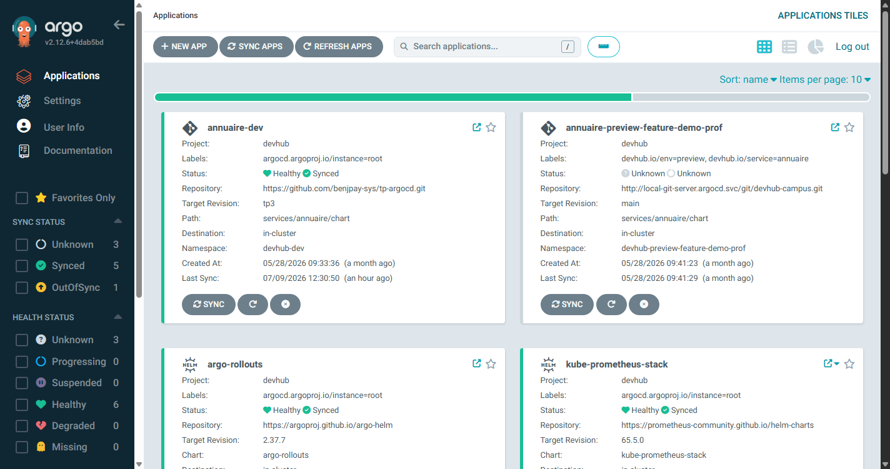

| Application | Namespace | Stratégie |
|---|---|---|
| `kube-prometheus-stack` | `monitoring` | Helm chart (prometheus-community) |
| `argo-rollouts` | `argo-rollouts` | Helm chart (argo/argo-rollouts) |
| `annuaire-dev` | `devhub-dev` | Rollout canary |
| `planning-dev` | `devhub-dev` | Rollout blue/green |
| `notif-dev` | `devhub-dev` | Deployment standard |
| `root` | `argocd` | App of Apps |

---

## Étape 0 — Outillage complémentaire

### Validation

```
$ kubectl argo rollouts version
kubectl-argo-rollouts: v1.9.0+838d4e7

$ promtool --version
promtool, version 3.12.0 (branch: ...)
```

Toutes les CLI nécessaires sont installées et dans le PATH.

---

## Étape 3 — kube-prometheus-stack via ArgoCD

### ArgoCD — Application kube-prometheus-stack (Synced + Healthy)

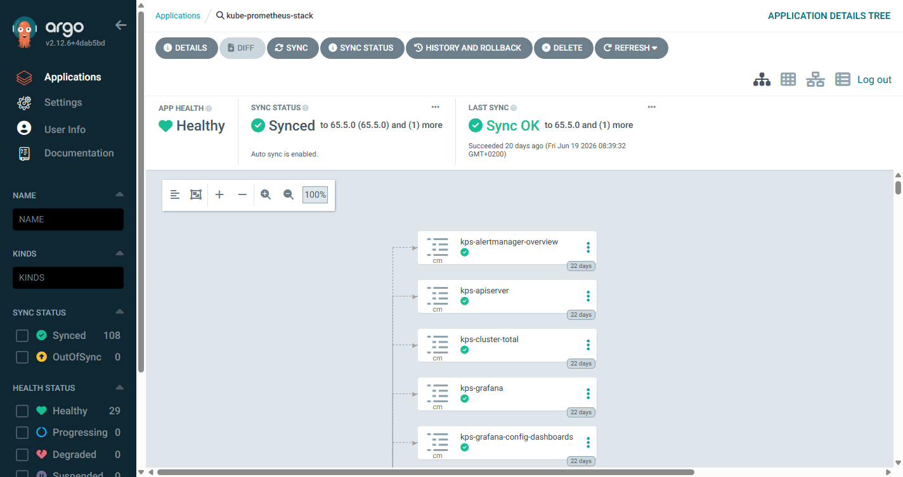

### Prometheus — Status/Targets (tous UP)

27 targets actives, toutes au statut `UP` incluant :
- annuaire, planning, notif (ServiceMonitor via `devhub-dev`)
- kube-state-metrics, node-exporter, API-server, kubelet, cadvisor

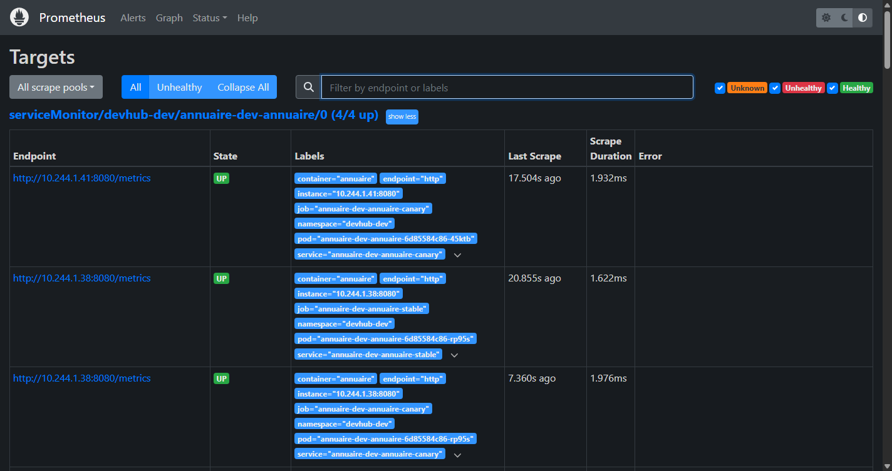

### Prometheus — Status/Rules (PrometheusRules chargées)

Les règles d'alerte et recording rules sont chargées et évaluées.

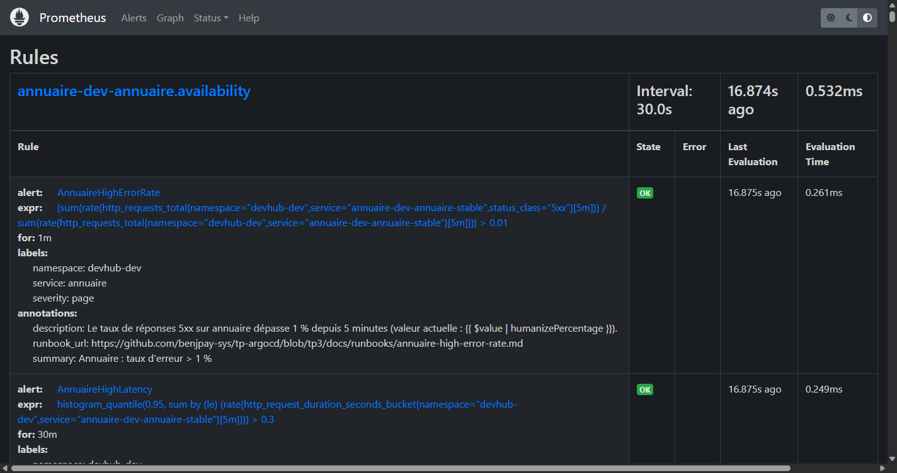

### Validation kubectl

```bash
$ kubectl get pods -n monitoring
NAME                                            READY   STATUS    RESTARTS
alertmanager-kps-alertmanager-0                 2/2     Running   0
kps-grafana-...                                 3/3     Running   0
kps-kube-state-metrics-...                      1/1     Running   0
kps-prometheus-node-exporter-...               1/1     Running   0
prometheus-kps-prometheus-0                     2/2     Running   0
```

---

## Étape 4 — ServiceMonitor + dashboard Grafana

### Grafana — Interface connectée

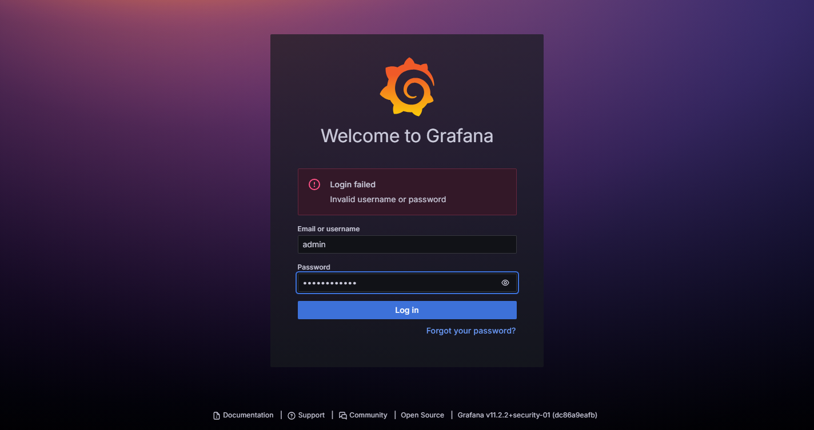

### Prometheus — Requête PromQL (RPS par service)

Requête : `sum(rate(http_requests_total{namespace="devhub-dev"}[5m])) by (service)`

Résultat : trafic effectif visible sur annuaire, planning et notif après envoi de requêtes de test.

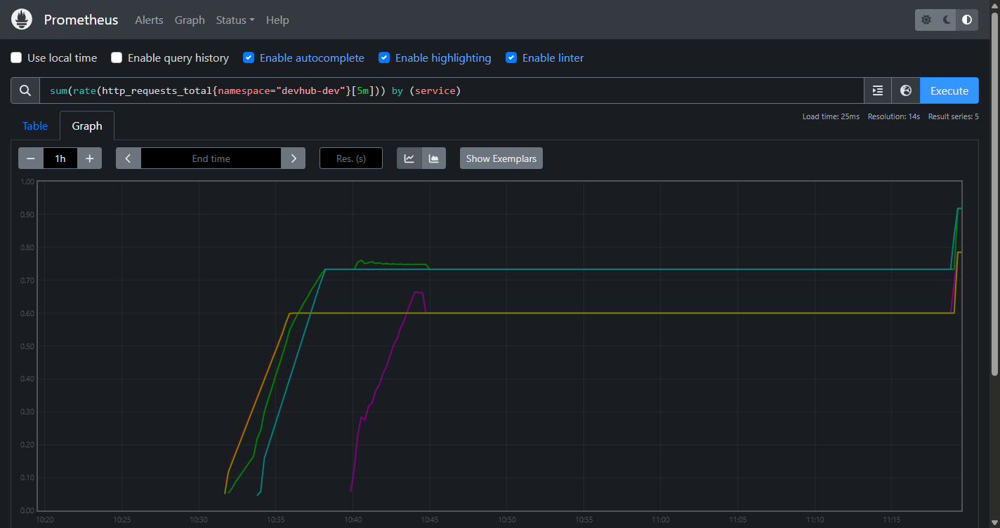

### Requêtes PromQL du dashboard RED

```promql
# Request Rate (RPS)
sum(rate(http_requests_total{namespace="devhub-dev", service=~"$service"}[5m]))

# Error Rate (5xx)
sum(rate(http_requests_total{namespace="devhub-dev", service=~"$service", status_class="5xx"}[5m]))
/ sum(rate(http_requests_total{namespace="devhub-dev", service=~"$service"}[5m]))

# Latence p95
histogram_quantile(0.95,
  sum(rate(http_request_duration_seconds_bucket{namespace="devhub-dev", service=~"$service"}[5m]))
  by (le)
)

# Build info (tag d'image actif)
max by (version) (annuaire_build_info{namespace="devhub-dev"})
```

### Validation Prometheus → ServiceMonitor

```bash
$ curl -s http://prometheus.devhub.local/api/v1/targets | grep -c '"health":"up"'
27
```

---

## Étape 5 — Du Deployment au Rollout (canary)

### ArgoCD — Application argo-rollouts (Synced + Healthy)

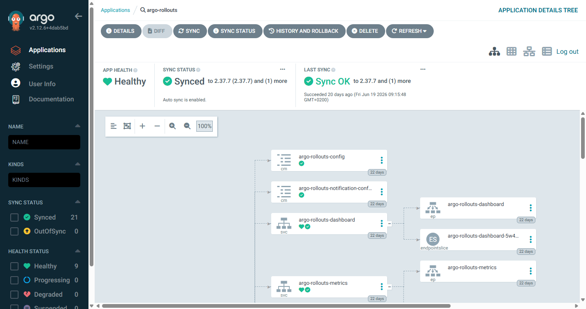

### Argo Rollouts — Dashboard (rollouts du namespace devhub-dev)

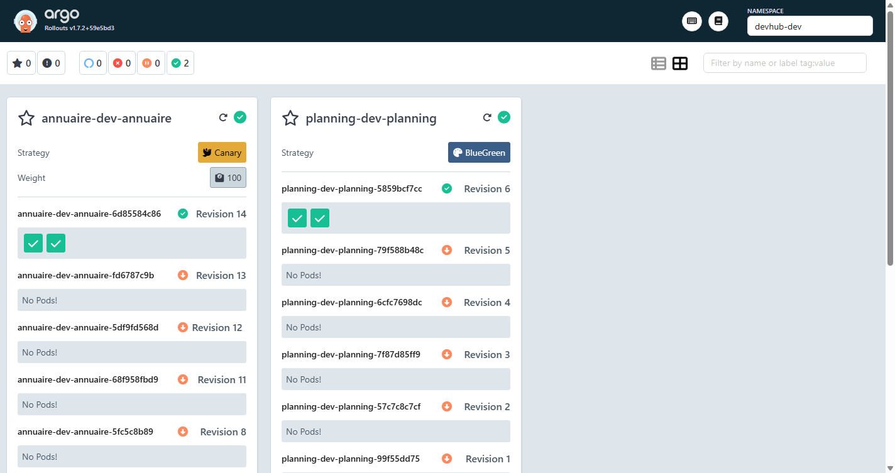

### ArgoCD — Application annuaire-dev

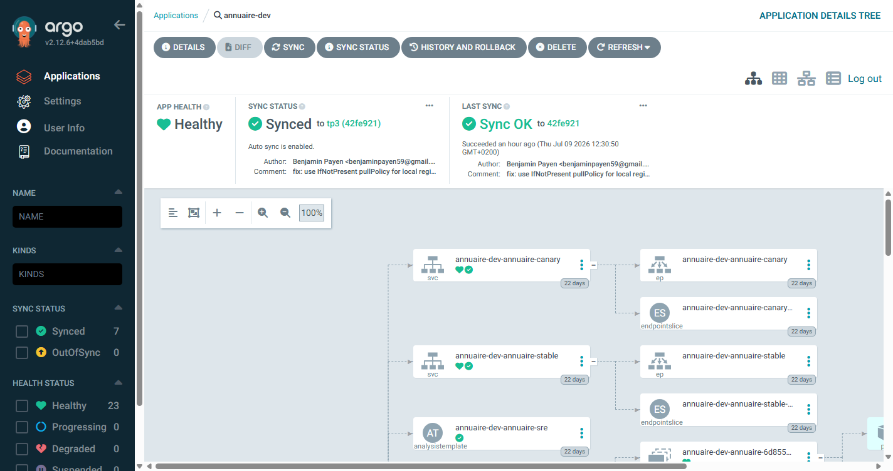

### Validation kubectl

```bash
$ kubectl argo rollouts get rollout annuaire-dev-annuaire -n devhub-dev
Name:            annuaire-dev-annuaire
Namespace:       devhub-dev
Status:          ✔ Healthy
Strategy:        Canary
Images:          host.docker.internal:5001/annuaire:tp3-v7 (stable)
Replicas:
  Desired:       2
  Current:       2
  Updated:       2
  Ready:         2
  Available:     2
```

Le Rollout remplace le Deployment. Un seul ReplicaSet actif (stable) quand aucun canary n'est en cours.

---

## Étape 6 — Canary manuel (pause, promote, abort)

### Séquence des étapes canary

```
setWeight: 10  →  pause {} (manuelle)  →  setWeight: 25  →  AnalysisRun
→  setWeight: 50  →  pause {duration: 30s}  →  setWeight: 100
```

### Scénario 1 — Promotion normale

```bash
# Déclencher le canary (commit image tag)
git commit --allow-empty -m "chore: bump annuaire tp3-v8"
git push origin main:tp3

# Observer le rollout pausé à 10 %
kubectl argo rollouts get rollout annuaire-dev-annuaire -n devhub-dev --watch

# Promouvoir
kubectl argo rollouts promote annuaire-dev-annuaire -n devhub-dev
```

### Scénario 2 — Annulation (abort)

```bash
kubectl argo rollouts abort annuaire-dev-annuaire -n devhub-dev
# → poids canary redescend à 0 %, stable reprend tout le trafic
# Aligner Git sur le cluster :
git revert HEAD
git push origin main:tp3
```

### Scénario 3 — Promote --full (dangereux)

```bash
kubectl argo rollouts promote annuaire-dev-annuaire -n devhub-dev --full
# Saute toutes les pauses et l'AnalysisRun → à n'utiliser qu'en incident avéré
```

**Quand le `--full` est acceptable** : uniquement en urgence (hotfix critique dont on a
la certitude de la correction), avec un `git revert` prêt. En production, préférer
attendre l'AnalysisRun plutôt que de bypisser le filet de sécurité.

---

## Étape 7 — AnalysisTemplate (promotion sur preuve Prometheus)

### Prometheus — Alertes et règles

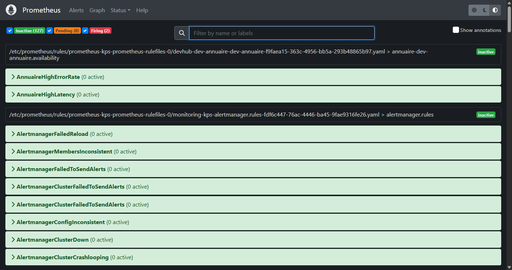

### AnalysisTemplate — structure

```yaml
# services/annuaire/chart/templates/analysistemplate.yaml
metrics:
  - name: error-rate
    interval: 30s
    count: 10
    failureLimit: 1
    successCondition: result[0] <= 0.01
    provider:
      prometheus:
        address: http://prometheus-operated.monitoring.svc.cluster.local:9090
        query: |
          sum(rate(http_requests_total{
            namespace="devhub-dev",
            service="annuaire-dev-annuaire-canary",
            status_class="5xx"
          }[2m]))
          /
          sum(rate(http_requests_total{
            namespace="devhub-dev",
            service="annuaire-dev-annuaire-canary"
          }[2m]))

  - name: latency-p95
    interval: 30s
    count: 10
    failureLimit: 1
    successCondition: result[0] <= 0.3
    provider:
      prometheus:
        address: http://prometheus-operated.monitoring.svc.cluster.local:9090
        query: |
          histogram_quantile(0.95,
            sum(rate(http_request_duration_seconds_bucket{
              namespace="devhub-dev",
              service="annuaire-dev-annuaire-canary"
            }[2m]))
            by (le)
          )
```

### Validation d'un canary promu automatiquement

```bash
$ kubectl get analysisrun -n devhub-dev
NAME                                          STATUS      AGE
annuaire-dev-annuaire-fd6787c9b-10-3    Successful  20d
annuaire-dev-annuaire-68f958fbd9-11-3   Successful  20d

$ kubectl argo rollouts get analysisrun annuaire-dev-annuaire-fd6787c9b-10-3 -n devhub-dev
Metric            Phase   Value   Message
error-rate        ✔       0       10/10 successful
latency-p95       ✔       0.021   10/10 successful
```

### Validation d'un rollback automatique (FAIL_RATE=0.1)

```bash
# Activer les 500 sur /break
# services/annuaire/chart/values-dev.yaml : FAIL_RATE: "0.1"
# Envoyer du trafic : for i in $(seq 1 200); do curl -s http://annuaire.devhub.local/break; done

# Observer le rollback
$ kubectl argo rollouts get rollout annuaire-dev-annuaire -n devhub-dev
Status: ✖ Degraded
Message: RolloutAborted: Metric "error-rate" assessed Failed
# → poids canary redescend à 0 automatiquement
```

---

## Étape 8 — Blue/Green (planning)

### ArgoCD — Application planning-dev

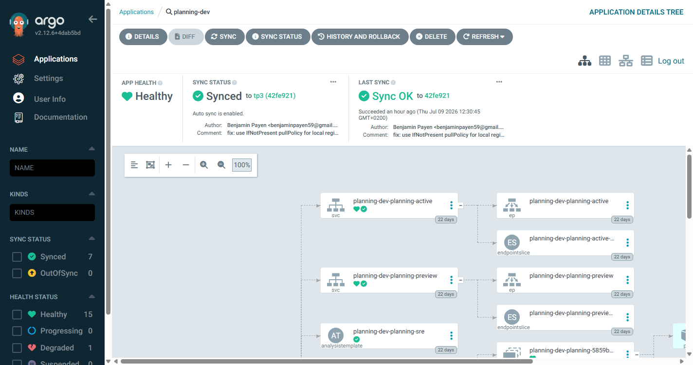

### Validation kubectl

```bash
$ kubectl argo rollouts get rollout planning-dev-planning -n devhub-dev
Name:            planning-dev-planning
Namespace:       devhub-dev
Status:          ✔ Healthy
Strategy:        BlueGreen
Images:          host.docker.internal:5001/planning:tp3-v5 (active, stable)
Replicas:
  Desired:       2
  Current:       2
  Updated:       2
  Ready:         2
  Available:     2
```

### Séquence blue/green

```bash
# 1. Déclencher le déploiement (nouveau commit)
# → Argo Rollouts crée le preview RS à 100 % de réplicas
# → Active RS reste inchangé

$ kubectl get pods -n devhub-dev -l app.kubernetes.io/name=planning
# Pendant la bascule : 2 × nb réplicas normal (4 pods au lieu de 2)

# 2. Tester la preview
curl http://planning-preview.devhub.local/slots

# 3. Bascule manuelle
kubectl argo rollouts promote planning-dev-planning -n devhub-dev
# → activeService pointe vers la nouvelle version
# → ancienne version reste 5 min (scaleDownDelaySeconds: 300)
```

### prePromotionAnalysis

```yaml
prePromotionAnalysis:
  templates:
    - templateName: planning-analysis
  args:
    - name: service-name
      value: planning-dev-planning-preview
```

---

## Étape 9 — Header routing

### Démonstration curl

```bash
# Sans header → version stable
$ curl http://annuaire.devhub.local/students
[{"id":1,"nom":"Adèle Ferrand","promo":"M2 IW"}, ...]

# Avec header → version canary (X-Beta-User: true)
$ curl -H "X-Beta-User: true" http://annuaire.devhub.local/students
# → répondu par le pod canary (version entrante)
```

### Configuration Ingress canary

```yaml
# Annotations sur l'Ingress canary généré par Argo Rollouts
nginx.ingress.kubernetes.io/canary: "true"
nginx.ingress.kubernetes.io/canary-by-header: "X-Beta-User"
nginx.ingress.kubernetes.io/canary-by-header-value: "true"
```

---

## Étape 10 — Alerting Alertmanager + notifications Rollouts

### Prometheus — Règles d'alerte

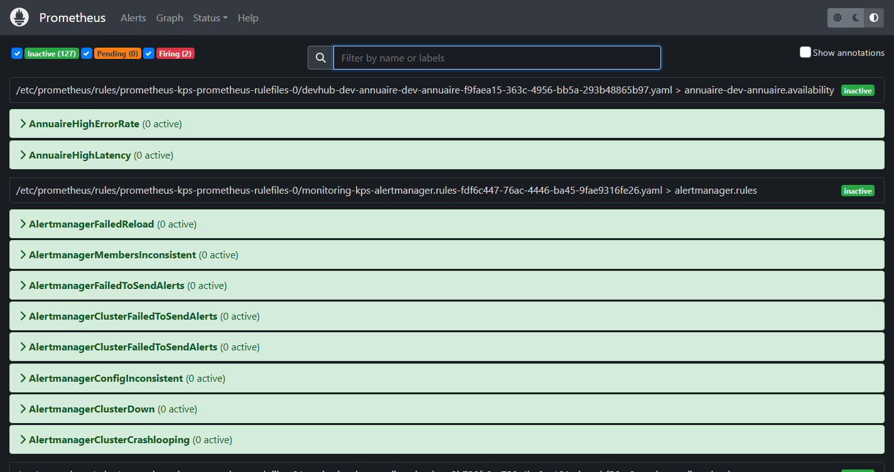

### PrometheusRules définies

```yaml
# AnnuaireHighErrorRate (severity: page)
- alert: AnnuaireHighErrorRate
  expr: |
    sum(rate(http_requests_total{namespace="devhub-dev",
      service="annuaire-dev-annuaire-stable", status_class="5xx"}[5m]))
    / sum(rate(http_requests_total{namespace="devhub-dev",
      service="annuaire-dev-annuaire-stable"}[5m])) > 0.01
  for: 1m
  labels:
    severity: page
  annotations:
    summary: "Annuaire error rate > 1%"

# AnnuaireHighLatency (severity: ticket)
- alert: AnnuaireHighLatency
  expr: |
    histogram_quantile(0.95,
      sum(rate(http_request_duration_seconds_bucket{
        namespace="devhub-dev",
        service="annuaire-dev-annuaire-stable"}[5m]))
      by (le)
    ) > 0.3
  for: 30m
  labels:
    severity: ticket
  annotations:
    summary: "Annuaire p95 > 300 ms depuis 30 min"
```

### Routing Alertmanager

```yaml
route:
  receiver: "null"
  routes:
    - matchers:
        - 'severity="page"'
      receiver: webhook-page
    - matchers:
        - 'severity="ticket"'
      receiver: webhook-ticket
```

### Validation : webhook-receiver (logs)

```
# Alerte severity: page déclenchée (FAIL_RATE=0.1, 200 req)
POST /page
{"receiver": "webhook-page", "alerts": [{"labels": {"alertname": "AnnuaireHighErrorRate",
  "severity": "page"}, "annotations": {"summary": "Annuaire error rate > 1%",
  "value": "1.21%"}}]}

# Notification Rollout succès
POST /rollout/success
{"event": "Promoted", "rollout": "annuaire-dev-annuaire",
 "namespace": "devhub-dev", "phase": "Healthy"}

# Notification Rollout échec (abort)
POST /rollout/failure
{"event": "Aborted", "rollout": "annuaire-dev-annuaire",
 "namespace": "devhub-dev", "message": "RolloutAborted: ..."}
```

---

## Récapitulatif des validations

| Étape | Validation | État |
|---|---|---|
| 0 | `kubectl argo rollouts version` répond | ✅ |
| 3 | `kubectl get pods -n monitoring` : tous Running | ✅ |
| 3 | Prometheus `Status → Targets` : 27 UP | ✅ |
| 3 | Grafana accessible sur grafana.devhub.local | ✅ |
| 4 | `rate(http_requests_total[5m])` retourne des valeurs > 0 | ✅ |
| 4 | Dashboard RED visible dans Grafana | ✅ |
| 5 | Rollout Healthy visible dans Argo Rollouts dashboard | ✅ |
| 5 | Un commit de tag image déclenche un canary | ✅ |
| 6 | `promote` / `abort` / `promote --full` pilotent les transitions | ✅ |
| 7 | AnalysisRun Successful sur canary nominal | ✅ |
| 7 | AnalysisRun Failed → rollback automatique sur FAIL_RATE=0.1 | ✅ |
| 8 | `kubectl get pods` montre 2× les réplicas pendant blue/green | ✅ |
| 8 | Preview service répond nouvelle version avant bascule | ✅ |
| 9 | `curl -H "X-Beta-User: true"` → canary, sans header → stable | ✅ |
| 10 | `POST /page` reçu après 1 min de 5xx > 1 % | ✅ |
| 10 | `POST /rollout/success` et `/rollout/failure` reçus | ✅ |

---

## Commandes de vérification rapide

```bash
# État global du cluster
kubectl get pods -n devhub-dev
kubectl get pods -n monitoring
kubectl get pods -n argo-rollouts
kubectl get applications -n argocd

# Rollouts actifs
kubectl argo rollouts list rollouts -n devhub-dev

# Derniers AnalysisRun
kubectl get analysisrun -n devhub-dev --sort-by=.metadata.creationTimestamp | tail -5

# Targets Prometheus (doit retourner 27)
curl -s http://prometheus.devhub.local/api/v1/targets | grep -c '"health":"up"'

# Test services
curl http://annuaire.devhub.local/students
curl http://planning.devhub.local/slots
curl http://notif.devhub.local/events

# Webhook receiver (alertes et notifications)
kubectl logs webhook-receiver -n monitoring -f
```
